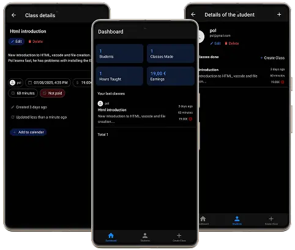
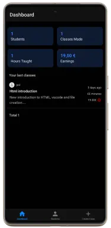
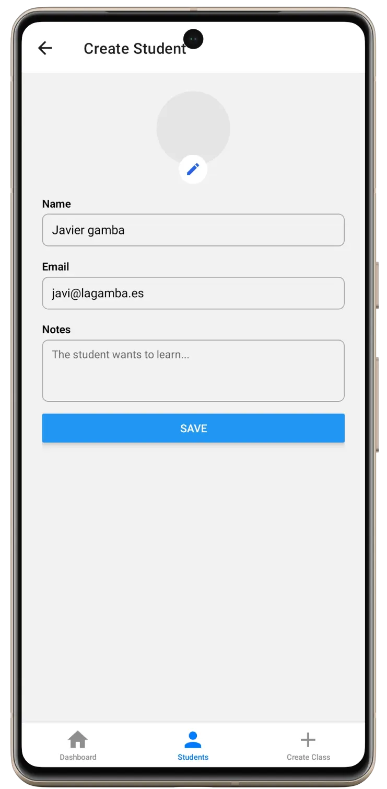
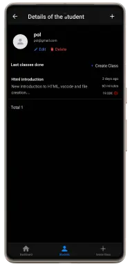
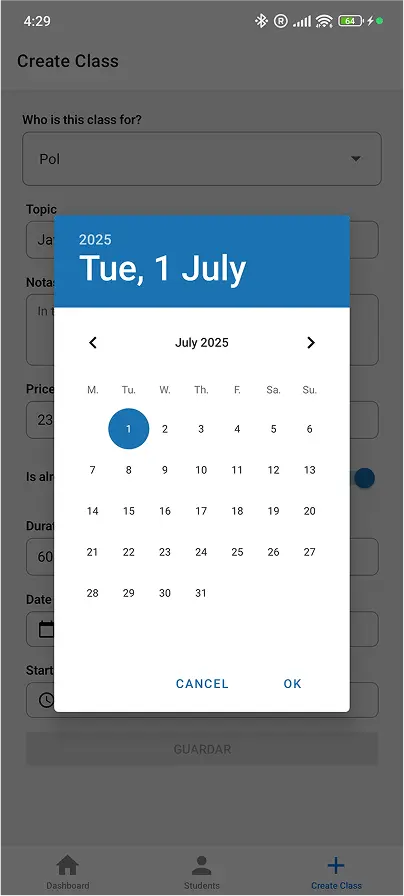

# 🎓 Tich – Personal Class Tracker

**Tich** is a mobile app designed for private tutors to manage, track, and organize their teaching activity in a clean, efficient way.

## ✨ Key Features

- 🧑‍🎓 Manage your student base with editable details and class history
- 🗓️ Log private classes with topic, notes, duration, hourly rate, and payment status
- 📊 Dashboard with key statistics and recent activity overview
- 🧭 Three-tab navigation: Dashboard, Students, and Create Class
- 🌗 Dark mode support
- 🌍 Full translations: English, Spanish, Catalan, German — all auto-selected from your device settings

## 🧩 Data Models

### 👨‍🎓 Student
- Photo
- Name
- Email
- Total number of classes
- Individual class history

### 📚 Class
- Linked student
- Topic / title
- Notes
- Duration
- Hourly rate
- Total earned
- Date and start time
- Paid status

## 🖥️ Screenshots

### 📊 Dashboard Overview

Displays global statistics:
- Total students
- Total classes
- Hours taught
- Total revenue

Also shows a chronological list of recent classes with:
- Topic
- Student (avatar + clickable name)
- Time ago (if < 1 month) or exact date
- Duration
- Hourly rate
- Description

---

### 🧑‍🎓 Students Tab

Filterable list of all students with:
- Profile photo
- Name
- Email
- Number of classes

Includes a button to add a new student.

---

### 🔍 Student Details

Expanded student profile with:
- Contact details
- Edit / delete buttons
- Class history filtered for this student only

---

### 📝 Create Class

Form with:
- Linked student
- Topic
- Class notes
- Price per hour
- Paid status
- Duration
- Date and starting time

Includes a date-time selector for easy scheduling.

 
---

## 🧪 Tech Stack

- React Native
- TypeScript
- Expo
- i18n with auto-detection
- Native dark mode support

---

## 🚀 Roadmap

- Calendar integration (iOS/Android)
- Payment tracking and reminders
- CSV export
- Desktop/web companion

---

## 📄 License

MIT

### Developer notes

Prod builds guide: https://docs.expo.dev/guides/local-app-production/
Eas submit android: https://github.com/expo/fyi/blob/main/creating-google-service-account.md